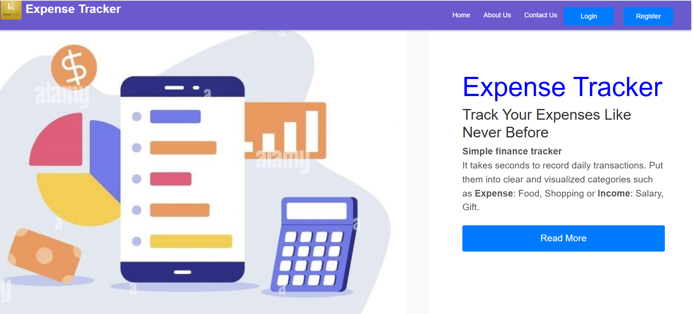
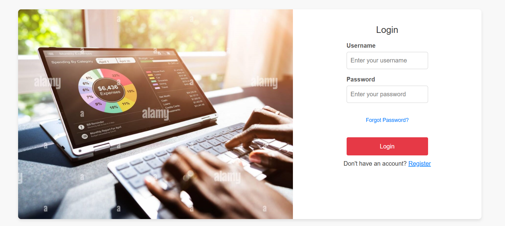
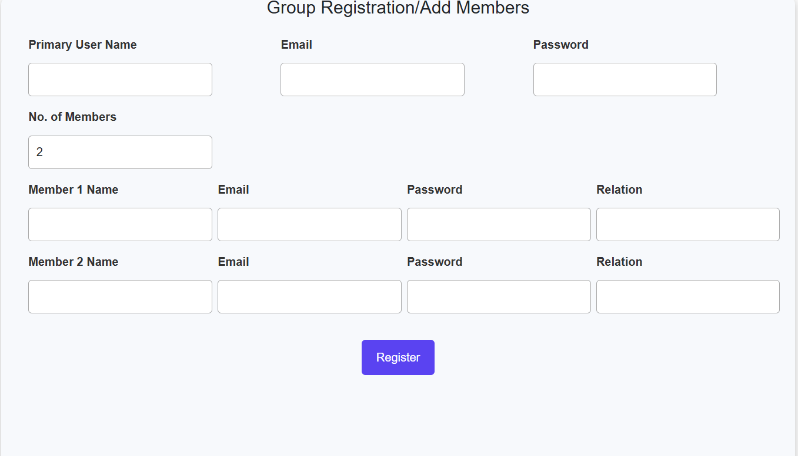
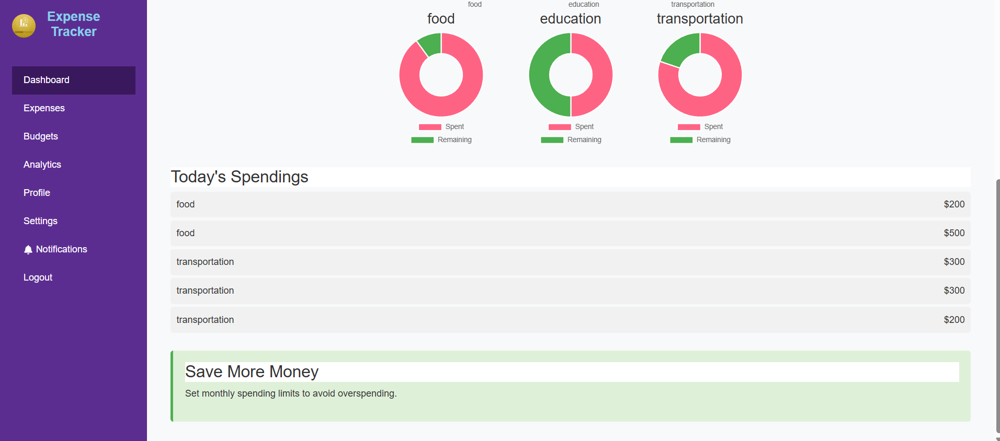
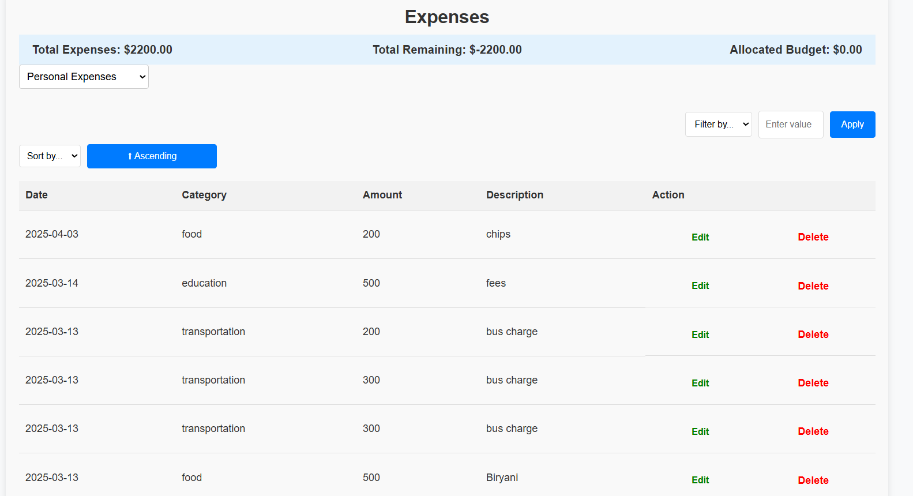
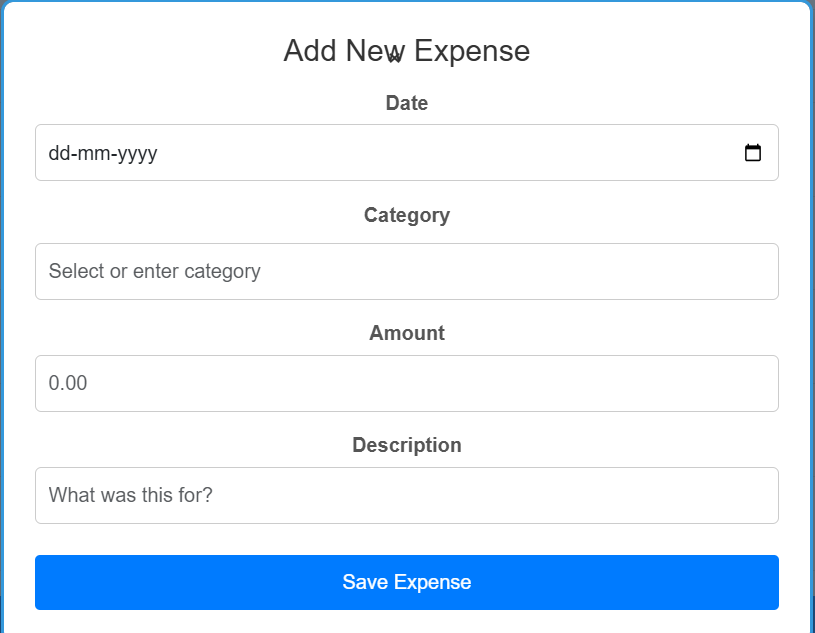
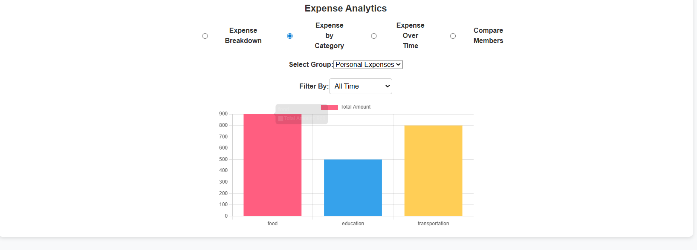
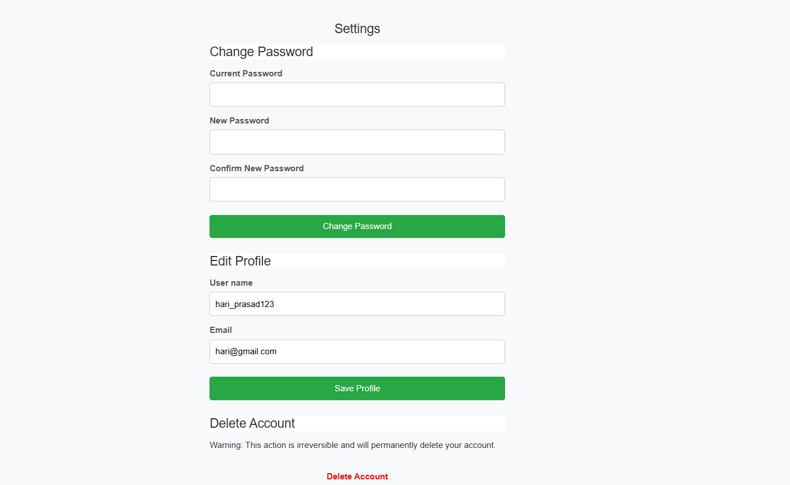

# 💸 Expense Tracker – MERN Stack

A full-featured web-based expense tracking app built using the MERN stack (MongoDB, Express.js, React.js, Node.js) that allows individuals and groups (like families or roommates) to collaboratively manage and monitor their financial activities.

---

## 🚀 Features

- ✅ User authentication and role-based access control
- ✅ Group creation and member invitation
- ✅ Expense categorization, editing, and filtering
- ✅ Budget management with alerts for overspending
- ✅ Visual analytics using Chart.js
- ✅ Real-time notifications for shared expenses
- ✅ Responsive UI with clean dashboard design

---

## 📷 Screenshots


### 🏠 Home Page  


### 🔐 Login & Register  
  




### 👥 User Dashboard  



### 💰 Expense Tracking  

  

### 💰 Budget Tracking  


### 📊 Analytics  


### 💰 Settings



---

## 🧑‍💻 Tech Stack

### Frontend:
- React.js
- HTML5, CSS3
- JavaScript
- Chart.js

### Backend:
- Node.js
- Express.js

### Database:
- MongoDB (Mongoose)

---

## 📂 Modules Overview

1. **User & Group Management**
   - Secure login, registration
   - Group creation and member invites through username and password to their mail
   - Role-based permissions (Group Creator/Member)

2. **Expense Tracking**
   - Add/edit/delete personal and shared expenses
   - Categorize, search, and filter expenses

3. **Budget & Analytics**
   - Define monthly budgets
   - Get alerts for overspending
   - View trends and category breakdowns using charts

4. **Notifications & Collaboration**
   - Real-time updates on group expense activity
   - Notifications for changes, overspending, and approvals

---

## ⚙️ How to Run Locally

### 1. Clone the repository:
```bash
git clone https://github.com/Padmaja3457/expense-tracker.git
cd expense-tracker
```
## 2. Install dependencies:
### Backend:

```bash
cd server
npm install
```
### Frontend:

```bash
cd client
npm install
```
## 3. Run the app:

### Backend:

```bash
npm run start
```

### Frontend:

```bash
npm start
```